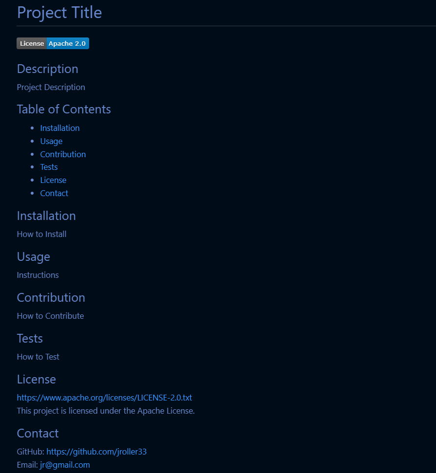

  # Node.js README.md Generator
  
  ## Description
  
  
  This is a node.js CLI tool that uses `inquirer` to dynamically generate a README.md from user input.

  ## Table of Contents
  - [Installation](#installation)
  - [Usage](#usage)
  - [Screenshots](#screenshots)
  - [Sample README Link](#sample-readme-link)
  - [Video Demo Link](#video-demo-link)
  - [Contribution](#contribution)
  - [Tests](#tests)
  - [License](#license)
  - [Contact](#contact)
  
  ## Installation
  1. Clone the repo (https://github.com/jroller33/README-Generator)
  2. Run `npm i` and then `node index.js` to start.
  
  ## Usage
  You will be asked a series of questions about the content for your README. The README that's generated will follow the same layout as this README.md and will be created in the same directory as 'index.js'. To write the README to a different path, follow these steps:
  1. open index.js
  2. go to line 66 (`.then((data) => writeFile('README.md', generateMarkdown(data)))`)
  3. Paste the path of the directory you want the README created in before 'README.md'. Example: `.then((data) => writeFile('/user/Documents/README.md', generateMarkdown(data)))`

  ## Screenshots
  ### Node.js Console Application:
   

  
   
   
  ### README.md Generated by Application:
  

#

  ## Sample README Link
  [Sample README](https://github.com/jroller33/README-Generator/blob/main/sampleREADME.md)

  ## Video Demo Link
  [Video Demo](https://youtu.be/tVjhJtsIsuI)
  

  ## Contribution
  You can contribute at https://github.com/jroller33/README-Generator
  
  ## Tests
  There are currently no tests for this application.

  ## License
  This project is licensed under the MIT License.  
  https://www.mit.edu/~amini/LICENSE.md

  ## Contact
  GitHub: https://github.com/jroller33  
  Email: jr@gmail.com